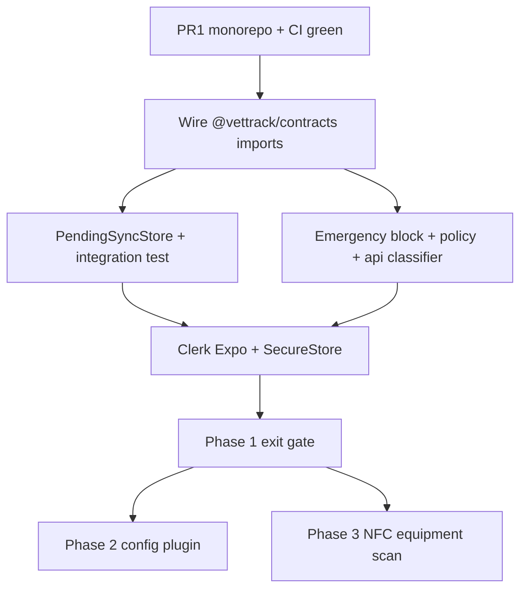

# VetTrack Mobile Strategy — Master Plan

**Canonical repo:** [exposwifty31/literate-dollop](https://github.com/exposwifty31/literate-dollop)  
**Production maintenance:** `~/vettrack` — Capacitor Build 15 ([`exposwifty31/vettrack`](https://github.com/exposwifty31/vettrack) on GitHub; GitLab declared canonical, GitHub ahead in practice until P0-1 resolves). Read-only port reference.

---

## Mission

Execute Expo/React Native migration alongside Capacitor until workflow parity and internal beta gates pass. Success = Phase 1 exit green → clinical vertical slice (Phase 3) → Phase 6 kill-switch decision on Capacitor retirement.

**Bundle ID:** `uk.vettrack.expo` (never `uk.vettrack.app` until Phase 6 go/no-go).

---

## Phases

| Phase | Scope | Exit gate |
|-------|-------|-----------|
| **PR1** | Monorepo bootstrap, `@vettrack/contracts` in-repo, CI | `contracts:gate` + typecheck green on GitHub Actions |
| **1** | Contracts wired, offline seam, Clerk Expo | Three exit criteria below |
| **2** | VetTrackControl config plugin (Swift widget) | Dev build with widget target |
| **3** | NFC equipment scan vertical slice ([spec](../superpowers/specs/2026-06-17-phase3-nfc-equipment-scan-design.md)) | One end-to-end offline-capable workflow |
| **4–5** | Route parity expansion | Per-route checklist |
| **6** | Capacitor kill-switch | Go/no-go on `uk.vettrack.app` retirement |

---

## Phase 1 exit criteria (blocks all UI porting)

1. **`@vettrack/contracts` v0.1.0+** lives in `packages/contracts/` and is imported by `apps/expo`
2. **`PendingSyncStore`** (`expo-sqlite`) + enqueue/replay integration test passes per [ADR 001](../adr/001-offline-storage.md)
3. **`@clerk/clerk-expo`** sign-in + API auth headers on device

Do not start Expo Router screen ports beyond bootstrap until all three pass.

---

## Implementation order (post-PR1)



1. Add `vitest` + `expo-sqlite` to `apps/expo`
2. Implement `PendingSyncStore` per ADR 001
3. Integration test: enqueue offline mutation → replay → synced
4. Port emergency three-module seam; assert Code Blue never hits SQLite
5. `@clerk/clerk-expo` + `vettrack://` redirect; one authenticated API call

---

## Frozen doctrine

- **Code Blue:** online-only mutations; never add emergency types to `PendingSyncType`
- **Emergency classifier** runs at `api.request()` before any SQLite write
- **No** realtime SSE / BroadcastChannel / service worker in Expo until post–Phase 6 unless explicitly approved
- **No** hand-editing `ios/` under `apps/expo` after prebuild — config plugins only (Phase 2+)
- **ADR 001:** `expo-sqlite` PendingSyncStore, not Dexie/WatermelonDB

---

## Port reference map (from local `~/vettrack`)

### Phase 1

| vettrack reference | literate-dollop destination |
|--------------------|----------------------------|
| `src/lib/offline-emergency-block.ts` | `apps/expo/src/lib/offline-emergency-block.ts` |
| `src/lib/offline-policy.ts` | `apps/expo/src/lib/offline-policy.ts` |
| `src/lib/api.ts` (request + classifier hook) | `apps/expo/src/lib/api.ts` |
| `tests/code-blue-offline-queue-removed.test.ts` | `tests/code-blue-offline.test.ts` |
| ADR 001 adapter | `apps/expo/src/lib/offline/pending-sync-store.ts` |

### Phase 2

| vettrack reference | literate-dollop destination |
|--------------------|----------------------------|
| `ios/App/VetTrackControl/*.swift` | `plugins/vettrack-control/ios/` |
| config plugin | `plugins/vettrack-control/withVetTrackControl.ts` |

### Phase 3

| vettrack reference | literate-dollop destination |
|--------------------|----------------------------|
| `src/lib/nfc-platform.ts` | `apps/expo/src/lib/nfc-platform.ts` |

### Do NOT move

- `server/`, `migrations/`, full `src/pages/` — maintenance monolith
- `tests/offline-phase-7-emergency-surface-parity.test.ts` — needs server/SW
- Capacitor `ios/`, `android/`, full vettrack CI
- Horizon 0 ship docs (`docs/mobile/native-ship-checklist.md`, `RESUBMISSION_RUNBOOK.md`)

---

## Local vettrack follow-up (human, optional)

After PR1 merges to `main`, local `~/vettrack` may point:

```json
"@vettrack/contracts": "github:exposwifty31/literate-dollop#path:packages/contracts&branch=main"
```

Agent work does not wait for this.

---

## Verification commands

```bash
pnpm install --frozen-lockfile
bash scripts/ci/contracts-gate.sh
pnpm --filter @vettrack/contracts exec tsc --noEmit
pnpm --filter vettrack-expo exec tsc --noEmit
```
