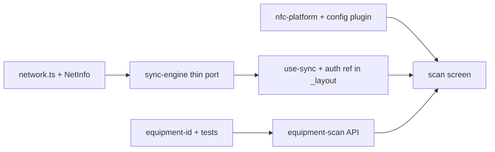

# Phase 3 — NFC Equipment Scan (Vertical Slice)

**Date:** 2026-06-17  
**Status:** Approved — ready for implementation plan  
**Repo:** exposwifty31/literate-dollop  
**Master plan ref:** [mobile-strategy-master.md](../../plans/mobile-strategy-master.md) Phase 3 exit gate  
**Supersedes:** Master plan label “NFC med-task flow” (legacy naming; see [Decisions](#decisions-operator-confirmed))

---

## Summary

Deliver one **end-to-end offline-capable clinical workflow**: NFC tag read → equipment scan mutation → SQLite queue → sync-engine replay when online.

Scope is **NFC equipment scan only** (`POST /api/equipment/:id/scan`, pending type `scan`). Not cabinet dispense, not medication-task API, not QR camera.

---

## Decisions (operator-confirmed)

| Question | Choice |
|----------|--------|
| Vertical slice | **A — NFC Equipment Scan** |
| URL scheme collision (`vettrack://` shared with Capacitor) | **C — Defer to Phase 6**; document in README; test devices should uninstall Capacitor or open Expo manually first |
| Platform | **Both iOS and Android** |
| Scan entry | **NFC-only** (no QR camera in Phase 3) |
| Scan confirmation | **Explicit confirm button** after NFC resolve (prevents accidental submit; thumb-zone CTA) |
| Offline queued UI | **Equipment UUID only** until replay; name from API response after online success or successful replay |
| Failed replay UX | **In scope:** `/scan` shows failed state + retry button when row is `failed`/`dead` |
| Master plan naming | **Update Phase 3 row** to “NFC equipment scan vertical slice” (this spec is authoritative) |

---

## Problem context

- Phase 1 exit is green: contracts, PendingSyncStore, Clerk, slim `api.request()`.
- Phase 2 widget opens `vettrack://scan` but on devices with **both** Capacitor (`uk.vettrack.app`) and Expo (`uk.vettrack.expo`) installed, iOS may route the deep link to Capacitor — observed as Capacitor web auth loading hang.
- Phase 3 cannot pass exit gate without **sync-engine replay** (queue enqueues today; nothing drains).
- **`network.ts` is a stub** (`isOnline()` always `true`) — reconnect-driven replay is blocked until NetInfo lands.

---

## Exit gate (acceptance)

On a **development build** (not Expo Go), physical device with NFC:

1. User opens `/scan` (tab, deep link, or widget — widget requires Capacitor absent or Expo already foreground).
2. User taps **Scan** → native NFC read → equipment ID resolved from NDEF URL/text.
3. User taps **Confirm** → `POST /api/equipment/:id/scan` with `{ status: "ok" }` and `X-Client-Timestamp`.
4. **Online:** success UI shows **equipment name** (from API `{ equipment, scanLog }`) + timestamp.
5. **Offline (airplane mode):** mutation enqueues to PendingSyncStore; UI shows **queued** with equipment UUID + queued time.
6. **Reconnect:** NetInfo fires → `use-sync` debounces → `processQueue()` replays with auth + timestamp headers; row reaches `synced`/removed; UI updates to **synced** with name if response includes it.

**Prerequisites before manual reconnect testing:** NetInfo wired, `setAuthStateRef` from Clerk, `use-sync` mounted in root layout.

**Acceptance devices:** operator iPhone (primary) + one Android NFC handset (model TBD — document in PR test notes).

Automated:

- `processQueue()` integration test: enqueue scan row → mock `fetch` → assert `X-Client-Timestamp`, `Authorization`, row removed/synced.
- Existing `code-blue-offline.test.ts` stays green.

---

## Critical path (implementation order)



NFC UI can proceed in parallel with sync-engine, but **exit gate step 6 cannot pass until A→C land**.

---

## Architecture

```mermaid
flowchart TD
  subgraph entry [Entry]
    W[Control Widget vettrack://scan]
    DL[Deep link handler]
    TAB[/scan screen]
  end
  subgraph nfc [NFC layer]
    NP[nfc-platform.ts]
    EID[equipment-id.ts]
  end
  subgraph api [API layer]
    REQ[api.request + offlineType scan]
    ES[equipment.scan helper]
  end
  subgraph offline [Offline layer]
    PS[PendingSyncStore]
    SE[sync-engine.ts]
    NI[NetInfo network.ts]
  end
  W --> DL --> TAB
  TAB --> NP --> EID --> ES --> REQ
  REQ -->|network error| PS
  NI -->|online| SE
  PS --> SE -->|replay fetch| REQ
```

### Module boundaries

| Module | Responsibility | Depends on | Complexity |
|--------|----------------|------------|------------|
| `network.ts` | Real `isOnline()`, `subscribeOnline()` | `@react-native-community/netinfo` | S |
| `nfc-platform.ts` | `isNfcSupported`, `readNfcOnce`, NDEF payload | `react-native-nfc-manager` | M |
| `equipment-id.ts` | `extractEquipmentId(raw)` — pure | none | S |
| `api/equipment-scan.ts` | `scanEquipment()` + timestamp header | `api.request`, types | S |
| `sync-engine.ts` | FIFO replay, retries, circuit breaker | PendingSyncStore, auth | L |
| `sync-auth-bridge.ts` | `setAuthStateRef` from Clerk | `@clerk/clerk-expo` | S |
| `use-sync.ts` | NetInfo → debounced `processQueue()` | sync-engine, network | S |
| `app/(app)/scan.tsx` | Touch-first scan UI + state machine | above + i18n | M |

---

## Approach comparison

### Sync-engine port

| Approach | Verdict |
|----------|---------|
| **Thin port (recommended)** | Core `processQueue`, retry/circuit/burst; PendingSyncStore via queue helpers; seams for toast/Sentry/QueryClient |
| Full port | Phase-9 reconciliation, conflict store, telemetry — out of scope |
| Scan-only hardcoded replay | Rejected — throws away reusable engine |

### NFC adapter

| Approach | Verdict |
|----------|---------|
| **`react-native-nfc-manager` + config plugin** | Matches expo FORK.md; dev build only |
| Custom Expo module | Phase 3 overkill |

---

## Components

### 0. Connectivity layer (prerequisite)

**Current stub:**

```typescript
// apps/expo/src/lib/network.ts — today
export function isOnline(): boolean {
  if (forcedOffline) return false;
  return true;
}
```

**Required deliverables:**

- Add `@react-native-community/netinfo` to `apps/expo/package.json`.
- Implement:
  - `isOnline(): boolean` — reads NetInfo cached state (`isConnected && isInternetReachable !== false`).
  - `subscribeOnline(callback: (online: boolean) => void): () => void` — NetInfo listener; debounce 500ms inside `use-sync` (iOS flapping).
- Keep `setForcedOfflineForTests()` for unit tests.
- Add `tests/network.test.ts` for forced-offline + listener contract (mock NetInfo).

### 1. Native NFC (`react-native-nfc-manager`)

- Add dependency + config plugin to `app.config.ts`.
- **iOS permission strings** — set in `app.config.ts` `ios.infoPlist` (not runtime locales; Apple reads plist at install):

```typescript
ios: {
  infoPlist: {
    NFCReaderUsageDescription:
      "VetTrack reads equipment NFC tags to record scans and checkout.",
    // Hebrew string duplicated in build notes if separate localized plist required later;
    // Phase 3 uses English plist + Hebrew UI copy via t().
  },
},
```

- Android: `android.permission.NFC` via plugin/manifest.
- Port surface from vettrack `nfc-platform.ts`:
  - Drop Capgo, Web NFC, Capacitor branches.
  - Keep: `readNfcOnce`, `isNfcSupported`, `isNfcSupportedSync`, `primeNfcSupportCache`, `NfcReadPayload`.
- Scan button ≥ 44pt; loading, error, retry states.

### 2. Equipment ID extraction

Port `equipment-id.ts` verbatim from vettrack (pure):

- `UNIVERSAL_LINK_ORIGIN`, `UNIVERSAL_LINK_HOST`
- `extractEquipmentId(raw)` parses `/equipment/:id` path segment from any URL with that path (including `https://vettrack.uk/equipment/:uuid`).
- **Does not** special-case `vettrack://` hostname — tags in production encode **HTTPS universal links** per vettrack doctrine. Fallback: raw UUID string with no spaces.

**Test fixtures** (`tests/equipment-id.test.ts`):

| Input | Expected |
|-------|----------|
| `https://vettrack.uk/equipment/abc-123` | `abc-123` |
| `https://vettrack.uk/equipment/abc-123?nfc=1` | `abc-123` |
| bare UUID string | same UUID |
| empty / whitespace | `null` |

### 3. API — scan only

`apps/expo/src/lib/api/equipment-scan.ts`:

```typescript
export type ScanEquipmentResult =
  | { kind: "synced"; equipment: Equipment; scanLog: ScanLog }
  | { kind: "queued"; equipmentId: string; pendingSyncId: number; queuedAt: number };
```

- `scanEquipment(id, body: ScanEquipmentRequest)`:
  - `clientTimestamp = Date.now()`
  - Live POST via `request()` with headers `{ "X-Client-Timestamp": String(clientTimestamp) }` and `{ offlineType: "scan", optimisticResult: { kind: "queued", equipmentId: id, queuedAt: clientTimestamp } }`
  - Online: return `{ kind: "synced", equipment, scanLog }` from response
  - Offline: return optimistic queued shape (UUID only — no name without cache)
- `api.request()` already persists `clientTimestamp` on enqueue — sync-engine replay must read it from the row.

### 4. Sync-engine

Port vettrack `sync-engine.ts` (~511 lines) with substitutions:

| vettrack | Expo |
|----------|------|
| `getPendingSync()` (all pending rows) | `getAllPendingSync()` from `pending-sync-queue.ts` |
| `updatePendingSync` / `removePendingSync` | same queue helpers wrapping store |
| `getAuthHeaders()` sync | `await getAuthHeaders()` async in replay |
| `sonner` | `sync-ui-seam.ts` — dev `console.warn`, prod noop |
| `@sentry/react` | omit |
| `QueryClient` | optional `onSyncComplete` noop |
| `conflict-store` / phase-9 | **409 → `failed`** with `structuredError`; no conflict UI in Phase 3 |
| `persistConflictPayload` | store `structuredError` on row only |

**Auth gate (required):**

Vettrack `processQueueBody` returns early without signed-in auth:

```typescript
if (!authStateGetter) return;
const authSnap = authStateGetter();
if (!authSnap?.isSignedIn || authSnap.isOfflineSession) return;
if (!(await getAuthHeaders()).Authorization) return;
```

Expo must wire:

- `apps/expo/src/lib/sync-auth-bridge.ts` — `setAuthStateRef(getter)` exported from sync-engine consumer side OR colocated in sync-engine.
- `apps/expo/src/hooks/use-sync-auth-bridge.ts` — reads Clerk `useAuth()`, calls `setAuthStateRef(() => ({ isSignedIn: !!isSignedIn && isLoaded, isOfflineSession: false }))`.

**Replay header contract** (port vettrack `attemptSync`; assert in `sync-engine.test.ts`):

| Header | Source |
|--------|--------|
| `Authorization` | `getAuthHeaders()` at replay time |
| `X-Client-Timestamp` | `String(item.clientTimestamp)` |
| `Idempotency-Key` | `item.idempotencyKey` when present |
| `X-Client-Mutation-Id` | `item.clientMutationId` when present |
| `Content-Type` | `application/json` |

Reference port checklist: vettrack `tests/sync-engine-replay-headers.test.ts`.

**Scan dedup:** `scan` is **not** deduplicated — append-only per `offline-mutation-registry` (`conflictStrategy: "append-only"`). Multiple offline scans queue separately.

**Dead/failed UX:** After `MAX_RETRIES`, row → `dead`. Scan screen listening to `onSyncStateChange` shows failed banner + **Retry** (calls `processQueue()` manually). No global sync sheet in Phase 3.

### 5. use-sync + mount points

`apps/expo/src/hooks/use-sync.ts`:

- On mount: `subscribeOnline((online) => { if (online) debouncedProcessQueue() })`
- Also call `processQueue()` once when Clerk auth bridge reports signed-in + online
- Debounce 500ms

**Modify `apps/expo/app/_layout.tsx`** (alongside existing `usePendingSyncStartup`):

```typescript
function RootLayoutNav() {
  usePendingSyncStartup();
  useSyncAuthBridge();  // setAuthStateRef
  useSync();            // NetInfo → processQueue
  // ...
}
```

### 6. Scan screen (native rebuild)

Replace `scan.tsx` stub — **remove all hardcoded English**; use `t.equipmentNfc.*`, `t.nfc.*`, `t.nfcEntry.*`, add keys under `scanScreen.*` if gaps exist.

**State machine:**

```
idle → scanning → resolved → submitting → success | queued | synced | failed
```

| State | UI |
|-------|-----|
| `idle` | Scan CTA (thumb zone) |
| `scanning` | Spinner + `t.nfc.scanning` or equipmentNfc |
| `resolved` | Show equipment UUID + **Confirm** + Cancel |
| `submitting` | Spinner |
| `success` | Equipment **name** + scan time (online API response) |
| `queued` | UUID + queued badge |
| `synced` | Name (from replay response if available) + synced badge |
| `failed` | Error message + Retry |
| unsupported | `t.nfc.error.scanFailed` pattern + settings hint |

Subscribe to `onSyncStateChange` while `queued` to transition → `synced` | `failed`.

Prime `isNfcSupportedSync()` on mount to avoid unsupported flash.

### 7. Deep link + auth

- Keep `deep-link-return.ts` + auth `returnTo`.
- Replace Clerk layout `return null` while loading with minimal loading shell (Hebrew `t.auth.guard.loadingApp`) — prevents blank screen on cold widget open.
- README: scheme collision test protocol.

---

## Data flow — offline scan

```
readNfcOnce()
  → extractEquipmentId(payload.url ?? payload.text)
  → [resolved UI — user confirms]
  → scanEquipment(id, { status: "ok" })
       → request(..., headers: X-Client-Timestamp, offlineType: "scan")
            → network error → addPendingSync({ type: "scan", clientTimestamp, ... })
  → UI: queued (UUID)

[NetInfo: offline → online]
  → use-sync → processQueue()
       → auth gate (Clerk signed in)
       → fetch POST + Bearer + X-Client-Timestamp from row
       → success → removePendingSync
  → UI: synced
```

Code Blue: unchanged — classifier at `api.request()` before SQLite write.

---

## Storage API mapping (sync-engine)

| vettrack (`offline-db`) | Expo |
|-------------------------|------|
| `getPendingSync()` | `getAllPendingSync()` |
| `getPendingQueue()` | `store.getPendingQueue()` if FIFO ordering needed |
| `updatePendingSync(id, patch)` | add to `pending-sync-queue.ts` helper |
| `removePendingSync(id)` | add to `pending-sync-queue.ts` helper |
| `runStartupCleanup()` | `initializePendingSyncOnStartup()` (existing) |

---

## Testing

| Test | Type | Notes |
|------|------|-------|
| `network.test.ts` | Unit | forced offline, subscribe contract |
| `equipment-id.test.ts` | Unit | HTTPS UL + bare UUID fixtures |
| `sync-engine.test.ts` | Unit | retry, circuit breaker, **replay headers** |
| `sync-engine.integration.test.ts` | Integration | enqueue scan → `processQueue()` mock fetch → row gone |
| `pending-sync-store.integration.test.ts` | Extend | scan row shape |
| `code-blue-offline.test.ts` | Regression | stay green |
| Manual | Device | iPhone + Android; airplane mode cycle |

---

## Out of scope (Phase 3)

- QR / camera scanner (Phase 3.1)
- Equipment/rooms SQLite cache (ADR 001 Phase 3b)
- `equipment.seen`, checkout, return
- DispenseSheet / container NFC
- Medication-task API / UI
- `vettrack-expo://` scheme split (Phase 6)
- Full sync-engine telemetry / phase-9 reconciliation
- Global sync queue sheet UI

---

## Risks

| Risk | Mitigation |
|------|------------|
| Scheme routes to Capacitor | README; uninstall Capacitor on test devices |
| NFC hardware variance (Android) | Graceful unsupported UI; one Android acceptance device |
| Clerk cold deep link blank | Loading shell instead of `return null` |
| Auth not ready at replay | `setAuthStateRef` + skip until `isLoaded && isSignedIn` |
| NetInfo false positives | 500ms debounce on `processQueue` |
| Server rejects replay without timestamp | Test asserts `X-Client-Timestamp` on replay |
| Metro required for dev client | Document; EAS build embeds bundle |

---

## File checklist

**Create**

- `apps/expo/src/lib/nfc-platform.ts`
- `apps/expo/src/lib/equipment-id.ts`
- `apps/expo/src/lib/api/equipment-scan.ts`
- `apps/expo/src/lib/sync-engine.ts`
- `apps/expo/src/lib/sync-ui-seam.ts`
- `apps/expo/src/lib/sync-auth-bridge.ts` (or merge into sync-engine exports)
- `apps/expo/src/hooks/use-sync.ts`
- `apps/expo/src/hooks/use-sync-auth-bridge.ts`
- `tests/equipment-id.test.ts`
- `tests/network.test.ts`
- `tests/sync-engine.test.ts`
- `tests/sync-engine.integration.test.ts`

**Modify**

- `apps/expo/src/lib/network.ts` — NetInfo
- `apps/expo/src/lib/offline/pending-sync-queue.ts` — `updatePendingSync`, `removePendingSync` if missing
- `apps/expo/app/_layout.tsx` — mount `useSync`, `useSyncAuthBridge`
- `apps/expo/app/(app)/_layout.tsx` — Clerk loading shell (not `null`)
- `apps/expo/app/(app)/scan.tsx`
- `apps/expo/app.config.ts` — NFC plugin + `NFCReaderUsageDescription`
- `apps/expo/package.json` — `react-native-nfc-manager`, `@react-native-community/netinfo`
- `apps/expo/locales/{en,he}.json` — `scanScreen.*` keys if needed
- `README.md` — scheme collision, NFC dev build, reconnect prerequisites
- `docs/plans/mobile-strategy-master.md` — Phase 3 label
- `docs/porting-status.md` — Phase 3 in progress

---

## Self-review

- [x] Critical: NetInfo deliverable explicit
- [x] Critical: sync-engine auth ref specified
- [x] Critical: `X-Client-Timestamp` on live + replay
- [x] Online vs offline success UI data sources defined
- [x] NDEF format expectations match vettrack `equipment-id.ts`
- [x] Storage API mapping documented
- [x] `use-sync` mount point specified
- [x] Failed replay UX in scope
- [x] ADR 001 / Code Blue / i18n invariant aligned

---

## Next step

Invoke **writing-plans** → `docs/superpowers/plans/2026-06-17-phase3-nfc-equipment-scan.md`
